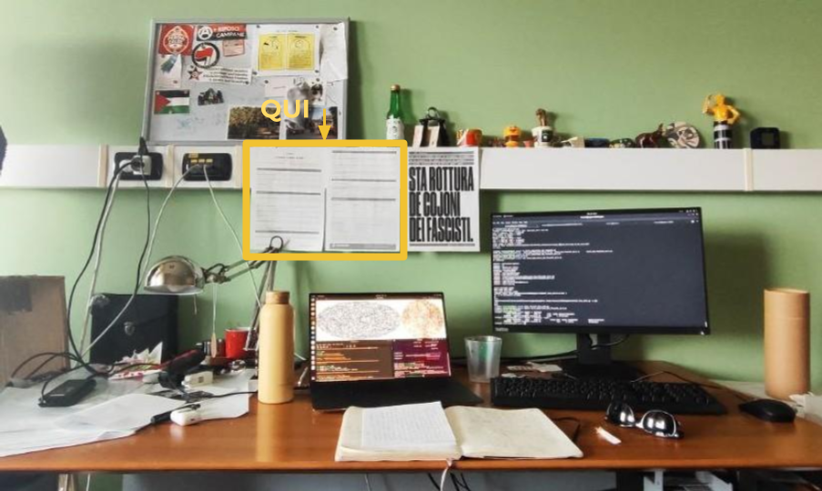

# Metodi computazionali per la fisica

**Ovvero, come ho imparato a non preoccuparmi e ad amare lo schermo nero.**

Questa repository raccoglie il materiale utilizzato per le lezioni del corso seminariale denominato vedisopra, tenuto all'Università di Cagliari.
Le lezioni sono state divise tra presentazioni, dimostrazioni su notebook e esercitazioni pratiche.

**DISCLAIMER 1:** il materiale qui raccolto è rivolto alle studenti che hanno frequentato il corso, non sostituisce né le lezioni né una passaggiata all'aperto.
Ciononostante, io sono solo uno schermo e non posso dirti cosa fare.

**DISCLAIMER 2:** (la maggior) parte del materiale è in inglese perché si.

## Mappa della repository

N.B. gli appuntamenti sono stati divisi tra lezioni vere e proprie, chiacchierate, dimostrazioni e indicibili torture (a.k.a. esercizi con il supporto, anche morale, de* docent*) 

- [Il programma](Metodi_Computazionali.pdf) del corso è riassunto nel file linkato
- [lectures](lectures) contiene il materiale utilizzato durante le sessioni di "oggi spiega e non interroga".
- [hands_on](hands_on) è la cartella che contiene gli esercizi proposti durante il corso ("oggi interroga").
- [datasets](datasets) contiene dei file che servono da input per alcune lezioni/esercitazioni.

## Elenco delle lezioni

- Lezione 1: di come passiamo senza troppi indugi dalle interfaccia grafiche al terminale
  - [L01_terminal+bash](lectures/L01_terminal+bash.pdf) si impara cos'è un terminale e come fonzinoa la shell
- Hands-on 1: il battesimo del fuoco.  
  - [exercise0_bash](hands-on/exercise0_bash) in cui si accompagnano le persone per mano in modo da capire meglio come funzionano script e batch
  - [exercise1_bash](hands-on/exercise1_bash) qui invece siete da sol*, dovrete creare uno script che rinomini un gruppo di file
- Lezione 2: su una maniera sensata per seguire l'evoluzione di un progetto ma anche sulla cooperazione e la comunicazione
  - [L02_git+github](lectures/L02_git+github.pdf) introduciamo Git e GitHub
- Hands-on 2: un progetto collaborativo su GitHub
  - [exercise2_git](hands-on/exercise2_git), non abbiate paura ad amarlo
- Lezione 3: Python 101, cominciamo dalle basi.
  - [L03.0_python101](lectures/L03.0_python101.pdf) sono le slide preparatorie, da qui in poi passeremo ad usare i jupyter notebook ma prima capiamoci qualcosa
  - [L03.1_python101](lectures/L03.1_python101.ipynb) qui si introducono i notebook e un po' di python vero, chiamiamolo "kit di sopravvivenza"
- Lezione 4: Standard Python, variabili e contenitori
  - [L04.1_Variables](lectures/L04.1_Variables.ipynb) introduce i diversi tipi di variabili native di python
  - [L04.2_Containers](lectures/L04.2_Containers.ipynb) iniziamo a lavorare con i container (liste, dizionari, eccetera)
- Lezione 5: Standard Python, sequenze di controllo e funzioni
  - [L05.1_ControlSequences](lectures/L05.1_ControlSequences.ipynb)
- Hands-on 3: partiamo facendo delle funzioni, ad un certo punto creeremo il nostro primo pacchetto
  - [exercise3_pythonbasics](hands-on/exercise1_pythonbasics) sono una collezioni di esercisi in cui vanno risolti dei semplici problemi matematici scrivendo delle piccole funzioni e degli script
- Lezione 6: Python 101, basi di programmazione orientata agli oggetti (Object Oriented Programming, OOP)
- Hands-on 4: esercizio OOP, una classe di numeri razionali.
  - [exercise4_classes](hands-on/exercise4_classes) questo è difficilotto e potrebbe essere anche considerato l'**ASSIGNMENT FINALE**, raccoglie un po' tutte le cose spiegate fin qui 
- Lezione 7: NumPy e gli Array
- Hands-on 5: array-programming e basi di ispezione di file e datasets.
- Bonus 1: ci saremo arrivati vivi fin qui?

> Le soluzioni degli esercizi (fatta eccezione per l'esercizio 2 che richiede esplicitamente di creare un'altra repository) possono essere caricate direttamente nel vostro fork di questa repository. Provate a mantenerla ordinata però: potreste ad esempio creare una sub-directory chiamata `soluzioni` nel root-level della repo oppure una sub-directory `soluzione` per ogni esercizio. #YourRepoYourChoice

## Link utili:

- A [questo link](https://docs.conda.io/projects/miniconda/en/latest/) trovate gli script per installare e configurare Miniconda3 nei vostri sistemi.
- Il [conda cheat sheet](https://docs.conda.io/projects/conda/en/latest/_downloads/843d9e0198f2a193a3484886fa28163c/conda-cheatsheet.pdf) è un documento più che sufficiente per la maggior parte delle domande del tipo "ma com'è che si faceva sta cosa in conda?" (tipo che io ce l'ho stampato e appeso di fronte al piccì)

